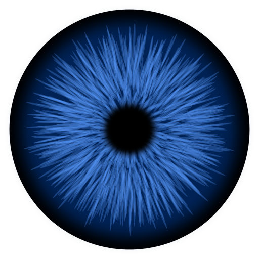

    
     
    <h1>Viseron</h1>
    

        Self-hosted, local only NVR and AI Computer Vision software.
    

    

        With features such as object detection, motion detection, face recognition and more, it gives you the power to keep an eye on your home, office or any other place you want to monitor.
    

    

        
    

    <h1></h1>
     

# Getting started

Getting started is easy! You simply spin up a Docker container and edit the configuration file using the built in web interface.

Head over to the [documentation](https://viseron.netlify.app) and follow the instructions on how to get started.

# Components

Viserons functionality is enabled by [components](https://viseron.netlify.app/docs/documentation/configuration#components).

You can find all the available components by using the [Component Explorer](https://viseron.netlify.app/components-explorer/).

# Community

Join the [Viseron Discord server](https://discord.gg/MxP5xpyvk7) to ask for help, share your setup and follow along with development.

Discord is the best place to get help with configuration and troubleshooting.
If you have found a confirmed bug or want to request a feature, open an [issue](https://github.com/roflcoopter/viseron/issues) instead.

# Contributing

Contributors to the project are very much appreciated.
See the [contribution guidelines](https://viseron.netlify.app/docs/contributing) on how to get started.

Some things you can help with:

- Implement an open feature request or issue from the [issue tracker](https://github.com/roflcoopter/viseron/issues)
- Improve the documentation
- Answer questions in issues, [discussions](https://github.com/roflcoopter/viseron/discussions) or on [Discord](https://discord.gg/MxP5xpyvk7)

You can also use the links below to sponsor Viseron or make a one time donation.

