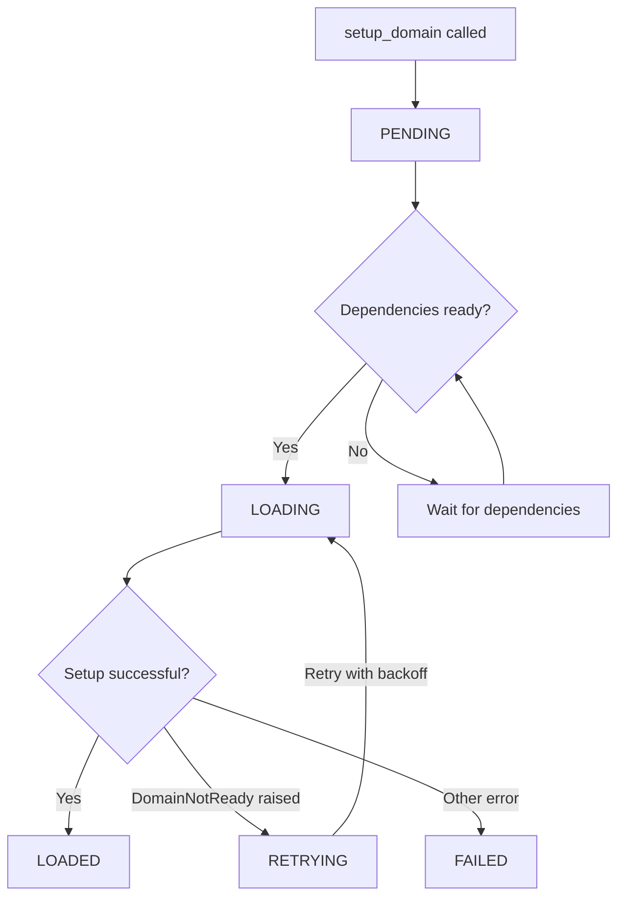

# Domains

Domains are interfaces that define core functionality types in Viseron. Multiple components can implement the same domain, providing a plug-and-play architecture with loose coupling.

## Available Domains

| Domain                      | Purpose                                    | Abstract Base Class               |
| --------------------------- | ------------------------------------------ | --------------------------------- |
| `camera`                    | Video stream capture                       | `AbstractCamera`                  |
| `object_detector`           | AI object detection                        | `AbstractObjectDetector`          |
| `motion_detector`           | Motion detection                           | `AbstractMotionDetector`          |
| `nvr`                       | Recording coordination                     | `AbstractNVR`                     |
| `face_recognition`          | Face recognition (post-processor)          | `AbstractFaceRecognition`         |
| `image_classification`      | Image classification (post-processor)      | `AbstractImageClassification`     |
| `license_plate_recognition` | License plate recognition (post-processor) | `AbstractLicensePlateRecognition` |

## Domain Lifecycle



### States

| State      | Description                                       |
| ---------- | ------------------------------------------------- |
| `PENDING`  | Registered, waiting for dependencies              |
| `LOADING`  | Dependencies resolved, setup in progress          |
| `LOADED`   | Successfully loaded and operational               |
| `FAILED`   | Setup failed permanently                          |
| `RETRYING` | Setup failed, will retry with backoff             |

## Implementing a Domain

To implement a domain, you need:

1. **Component registration** - Use `setup_domains()` in your component (see [Components](./components.mdx#component-architecture))
2. **Domain module** - Create a domain-specific module with a `setup()` function
3. **Domain class** - Extend the appropriate abstract base class

### Step 1: Register the Domain

In your component's `setup_domains()` function, call `setup_domain()` for each domain instance:

```python title="/viseron/components/fancy_component/__init__.py"
"""The fancy_component component."""
from __future__ import annotations

from typing import TYPE_CHECKING, Any

from viseron.domains import setup_domain
from viseron.domains.camera.const import DOMAIN as CAMERA_DOMAIN

from .const import COMPONENT, CONFIG_CAMERA

if TYPE_CHECKING:
    from viseron import Viseron


def setup_domains(vis: Viseron, config: dict[str, Any]) -> None:
    """Set up fancy_component domains."""
    config = config[COMPONENT]

    for camera_identifier, camera_config in config[CONFIG_CAMERA].items():
        setup_domain(
            vis,
            COMPONENT,
            CAMERA_DOMAIN,
            {camera_identifier: camera_config},
            identifier=camera_identifier,
        )

```

:::danger

It is very important that `setup_domains()` only registers domains and nothing else, since this method can be called multiple times during hot-reloading of configuration changes.

:::

### Step 2: Create the Domain Module

Create a module for your domain implementation with a `setup()` function:

```python title="/viseron/components/fancy_component/camera.py"
"""The fancy_component camera domain."""
from __future__ import annotations

from typing import TYPE_CHECKING, Any

from viseron.domains.camera import AbstractCamera
from viseron.exceptions import DomainNotReady

from .const import COMPONENT

if TYPE_CHECKING:
    from viseron import Viseron


def setup(vis: Viseron, config: dict[str, Any], identifier: str, attempt: int) -> bool:
    """Set up the fancy_component camera domain.

    Args:
        vis: The Viseron instance.
        config: Configuration passed to setup_domain.
        identifier: Unique identifier for this domain instance.
        attempt: Current setup attempt number (optional and can be omitted).

    Returns:
        True if setup was successful.

    Raises:
        DomainNotReady: If setup should be retried later.
    """
    try:
        Camera(vis, config[identifier], identifier)
    except ConnectionError as error:
        # Raise DomainNotReady to trigger retry with backoff
        raise DomainNotReady from error
    return True

```

### Step 3: Implement the Domain Class

Extend the abstract base class for your domain:

```python title="/viseron/components/fancy_component/camera.py"
from viseron.domains.camera import AbstractCamera


class Camera(AbstractCamera):
    """Represents a camera for fancy_component."""

    def __init__(
        self, vis: Viseron, config: dict[str, Any], identifier: str
    ) -> None:
        super().__init__(vis, COMPONENT, config, identifier)
        # Your initialization logic here

```

The `AbstractCamera` base class (and other abstract bases) automatically registers the domain instance with Viseron via the `__post_init__` hook.

## Dependency Management

Domains can declare dependencies on other domains using `RequireDomain` and `OptionalDomain`.

### Required Dependencies

Use `RequireDomain` when your domain **must** have another domain loaded first:

```python
from viseron.domains import RequireDomain, setup_domain
from viseron.domains.object_detector.const import DOMAIN as OBJECT_DETECTOR_DOMAIN


def setup_domains(vis: Viseron, config: dict[str, Any]) -> None:
    """Set up domains with required dependencies."""
    for camera_identifier in config[CONFIG_OBJECT_DETECTOR][CONFIG_CAMERAS].keys():
        setup_domain(
            vis,
            COMPONENT,
            OBJECT_DETECTOR_DOMAIN,
            config,
            identifier=camera_identifier,
            require_domains=[
                RequireDomain(
                    domain="camera",
                    identifier=camera_identifier,
                )
            ],
        )
```

The object detector will wait for the camera to be `LOADED` before its setup begins.

### Optional Dependencies

Use `OptionalDomain` when your domain **can use** another domain if it's configured:

```python
from viseron.domains import OptionalDomain, RequireDomain, setup_domain


setup_domain(
    vis,
    COMPONENT,
    NVR_DOMAIN,
    config,
    identifier=camera_identifier,
    require_domains=[
        RequireDomain(domain="camera", identifier=camera_identifier),
    ],
    optional_domains=[
        OptionalDomain(domain="object_detector", identifier=camera_identifier),
        OptionalDomain(domain="motion_detector", identifier=camera_identifier),
    ],
)
```

- If the optional domain is configured, Viseron waits for it before setup
- If the optional domain is NOT configured, Viseron ignores the dependency

## Error Handling

### DomainNotReady

Raise `DomainNotReady` when setup fails but should be retried:

```python
from viseron.exceptions import DomainNotReady


def setup(vis: Viseron, config: dict[str, Any], identifier: str, attempt: int) -> bool:
    try:
        connect_to_camera(config)
    except TimeoutError as error:
        raise DomainNotReady from error  # Will retry with backoff
    return True
```

Retries use backoff, starting at 10 seconds and increasing up to a maximum interval.

### Permanent Failures

For errors that should not be retried, let the exception propagate or raise a different exception. The domain will be marked as `FAILED`.
